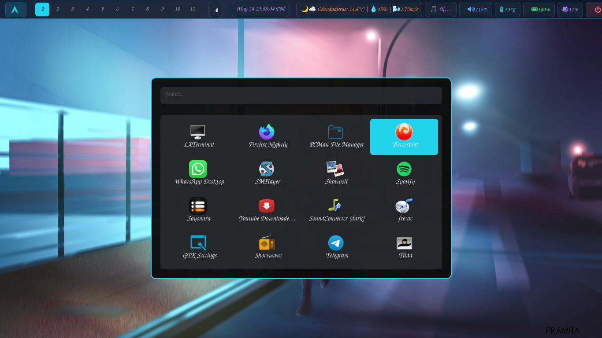
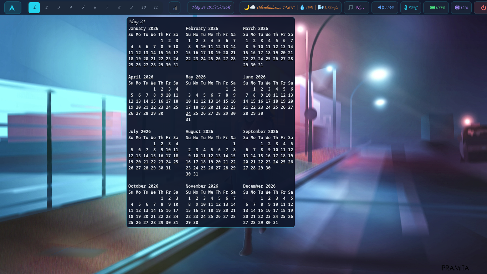
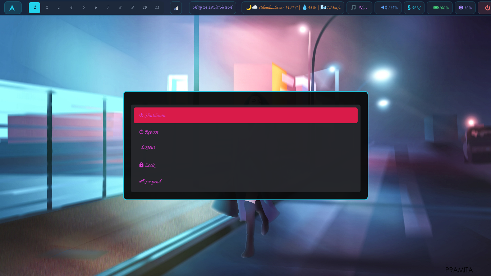

# River Dotfiles

  

Dynamic Tiling Wayland Compositor on Arch Linux.

---

## 📖 Documentation & Installation

For full installation instructions, keybinds, waybar configuration, and theming details, please visit the **[Official Documentation Website](https://wgparch.github.io/river/)**.

## 📸 Screenshots

